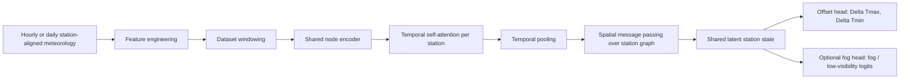

# Architecture Recap

Date: 2026-05-02

## Purpose

This note summarizes the **current implemented architecture** in the repo and the intended transition path from:

`temperature offset correction`

to:

`fog / low-visibility forecasting with offset prediction as the backbone`

It is written to match the codebase as it exists now, not an idealized future version.

## Current system in one sentence

The current model is a **shared spatiotemporal graph backbone** that consumes station-aligned ERA5-derived meteorology, performs temporal modeling and graph message passing over stations, and outputs:

- `offset` predictions for `ΔTmax` and `ΔTmin`
- optional `fog_logits` for binary fog / low-visibility classification

## High-level pipeline



## Data contract

The dataset loader is implemented in [dataset.py](</media/peridot/2TB1/Documents/Abhishek/offset prediction research/Offset-prediction/src/data/dataset.py:1>).

### Sample granularity

Each sample corresponds to:

- one forecast-valid time
- all stations at that time
- optionally a temporal window of preceding timesteps

So the sample is a **graph snapshot** or **graph sequence**, not a single station row.

### Input tensor shapes

The model accepts:

- `(N, F)` for single-timestep graph input
- `(T, N, F)` for temporal graph input

Where:

- `T` = sequence length
- `N` = number of stations
- `F` = number of node features

### Current feature stack

Default input size is `17` features:

```text
mx2t
mn2t
era5_t2m
era5_d2m
UG_era5
dewpoint_spread_2m
rh_2m
era5_u10
era5_v10
wind_speed_10m
theta_v_2m
theta_v_delta_1d
t2m_delta_1d
dewpoint_spread_delta_1d
height
sin_doy
cos_doy
```

These are either read directly from the aligned table or derived inside the dataset layer.

### Target tensors

Current offset targets:

```text
offset_tmax = TX - mx2t
offset_tmin = TN - mn2t
```

Returned as:

- `y`: shape `(N, 2)`
- `valid_mask`: shape `(N, 2)`

Optional fog labels:

- `fog_target`: shape `(N,)`
- `fog_valid_mask`: shape `(N,)`

The loader recognizes these label columns if present:

```text
fog_label
low_visibility_label
visibility_class
```

### Missing-data behavior

The design choice is:

- keep all stations in the graph
- mask missing labels in the loss
- do not drop nodes just because one target is missing

This is important because graph message passing still benefits from partially observed stations.

## Graph construction

The graph builder is implemented in [graph_builder.py](</media/peridot/2TB1/Documents/Abhishek/offset prediction research/Offset-prediction/src/data/graph_builder.py:1>).

### Topology

- static station graph
- directed `k`-nearest-neighbor edges
- default `k = 3`

For each target station `i`, the graph connects its nearest source stations `j`.

### Edge representation

Each directed edge carries `4` features:

```text
distance_km
delta_lat
delta_lon
delta_height
```

Where:

```text
delta = source - target
```

This preserves directionality, which matters for terrain and geographic gradients.

### Edge tensor shapes

- `edge_index`: `(2, E)`
- `edge_attr`: `(E, 4)`

Edge features are standardized before training.

## Core model

The main model is [OffsetMPT](</media/peridot/2TB1/Documents/Abhishek/offset prediction research/Offset-prediction/src/models/mpt.py:101>).

### Design intent

The architecture is meant to do three things:

1. encode local meteorology at each station
2. model short-term temporal evolution per station
3. propagate information across nearby stations using spatial attention

### Component breakdown

#### 1. Node encoder

Raw node features are projected into a shared latent space by `NodeEncoderMLP`:

```text
Linear(in_features -> hidden_dim)
GELU
LayerNorm
Linear(hidden_dim -> hidden_dim)
Dropout
```

Default:

- `in_features = 17`
- `hidden_dim = 64`

Output shape:

- single-step input: `(N, H)`
- sequence input before reshape: `(T * N, H)`

#### 2. Temporal encoder

When input is `(T, N, F)`, the model:

1. encodes each station-time token
2. reshapes to station-major layout `(N, T, H)`
3. adds learned temporal position embeddings
4. applies Transformer self-attention per station

Default temporal configuration:

- `temporal_layers = 1`
- `max_seq_len = 24`
- `heads = 4`

The temporal block uses:

```text
TransformerEncoderLayer(
    d_model=hidden_dim,
    nhead=heads,
    dim_feedforward=hidden_dim * 4,
    dropout=dropout,
    activation="gelu",
    batch_first=True,
    norm_first=True,
)
```

#### 3. Temporal pooling

After temporal encoding, the model collapses `(N, T, H)` to `(N, H)`.

Two modes exist:

- `last`: take the final timestep
- `attention`: learned attention-weighted pooling

Default:

```text
temporal_pooling = attention
```

This is more suitable for fog onset than plain last-step selection, because the model can learn whether the most important signal is:

- steady moistening
- sharp evening cooling
- weak overnight wind
- or a short precursor pulse

#### 4. Spatial message passing

Once each station has one latent vector `(N, H)`, the model applies stacked `TransformerConv` layers from PyTorch Geometric.

Default:

- `num_gnn_layers = 2`
- `heads = 4`
- `edge_dim = 4`
- `concat = False`

Each block is:

```text
TransformerConv(hidden_dim -> hidden_dim, edge_dim=4, heads=4, concat=False, beta=True)
Dropout
Residual add
LayerNorm
```

Why `concat=False` matters:

- output dimension stays at `hidden_dim`
- residual connections are simple
- the architecture remains compact for a small station graph

#### 5. Shared latent state

After the temporal and spatial stages, the model produces one shared latent representation per station:

```text
h_shared: (N, hidden_dim)
```

This is the backbone state used by all task heads.

## Task heads

### Offset head

Implemented as `OutputHeadMLP`.

Structure:

```text
Linear(hidden_dim -> hidden_dim//2)
GELU
Linear(hidden_dim//2 -> 2)
```

Output:

```text
[ΔTmax, ΔTmin]
```

Shape:

```text
(N, 2)
```

### Fog head

Implemented as `FogHeadMLP`.

Structure:

```text
Linear(hidden_dim -> hidden_dim//2)
GELU
Dropout
Linear(hidden_dim//2 -> fog_out_dim)
```

Current default:

- disabled unless `enable_fog_head=True`
- `fog_out_dim = 1` for binary logits

Output shape:

- binary case: `(N, 1)`

The model exposes this through `forward_multitask(...)`, which returns:

```python
{
    "hidden": h_shared,
    "offset": offset_pred,
    "fog_logits": fog_logits_or_none,
}
```

The standard `forward(...)` remains backward-compatible and returns offset predictions only.

## Loss design

Loss functions live in [loss.py](</media/peridot/2TB1/Documents/Abhishek/offset prediction research/Offset-prediction/src/utils/loss.py:1>).

### Offset loss

The regression loss is masked MAE:

```text
L_offset = lambda_tmax * MAE(ΔTmax) + lambda_tmin * MAE(ΔTmin)
```

Default weights:

- `lambda_tmax = 1.0`
- `lambda_tmin = 1.0`

### Multi-task loss

If fog labels are available and the fog head is enabled, training uses:

```text
L_total = L_offset + lambda_fog * BCEWithLogits(fog_logits, fog_target)
```

Default:

- `lambda_fog = 1.0`

Important behavior:

- if fog labels are missing for a station, that station is masked out of fog loss
- if the fog head is disabled, the system reduces to offset-only training

## Training pipeline

Training is implemented in [train.py](</media/peridot/2TB1/Documents/Abhishek/offset prediction research/Offset-prediction/src/train.py:1>).

### Current workflow

1. load the aligned table
2. normalize column aliases
3. split train / validation / test by the configured CV mode
4. fit the scaler on training rows only
5. build one static graph for all stations
6. iterate over time-indexed graph samples
7. train with masked losses
8. use early stopping based on validation score

### Cross-validation modes

Supported:

- `random`
- `slobo`
- `st_lobo`

The important one for the main research story is:

```text
st_lobo
```

because it tests both:

- spatial generalization across withheld stations
- temporal generalization across withheld windows

### Checkpoint contents

Training saves:

- model weights
- model config fields
- `feature_columns`
- scaler statistics

This matters because older and newer checkpoints may use different feature sets.

## Inference path

Inference is implemented in [inference.py](</media/peridot/2TB1/Documents/Abhishek/offset prediction research/Offset-prediction/src/inference.py:1>).

It supports:

- legacy offset-only checkpoints
- newer temporal models
- newer shared-backbone checkpoints with fog head

If fog logits are present, inference writes:

- `fog_logit`
- `fog_probability`

where:

```text
fog_probability = sigmoid(fog_logit)
```

## Current implementation status

### What is already true

The repo now has:

- fog-relevant meteorological feature engineering
- temporal sequence support
- temporal self-attention
- learned temporal pooling
- edge-aware spatial attention
- shared-backbone multitask support
- optional fog head
- masked handling of missing targets

### What is not yet true

The repo is **not yet a completed fog forecasting system**.

That is because the architecture is ready, but the experiment stack still needs:

- real hourly fog / visibility labels
- real hourly station-aligned data
- end-to-end fog training runs
- strong fog baselines
- final task-definition decisions

## Recommended interpretation for the paper

The cleanest paper framing is:

```text
shared spatiotemporal backbone
-> offset correction head
-> fog / low-visibility head
```

The offset head is not dead weight. It is the physics-aware intermediate task that stabilizes the backbone and gives a defensible interpretation:

- first learn local correction of coarse meteorology
- then use the corrected latent representation for fog-risk prediction

This is a stronger NeurIPS story than replacing offset prediction outright.

## Recommended next architecture step

The next meaningful implementation step is **not** another architectural rewrite.

It is:

1. move to hourly merged data
2. add a real fog target column
3. run `enable_fog_head=True`
4. compare against strong fog baselines

Only after that should we decide whether we need:

- explicit multi-class visibility heads
- lead-time-specific heads
- probabilistic calibration layers
- satellite fusion branches
- multi-task meteorology correction beyond temperature

## Bottom line

The current repo architecture is best described as:

`a fog-ready shared spatiotemporal graph backbone with offset prediction as the primary implemented task and fog prediction as the attached downstream head`

That is the correct description for collaborators, reviewers, and future implementation work.
