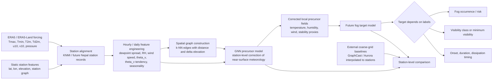
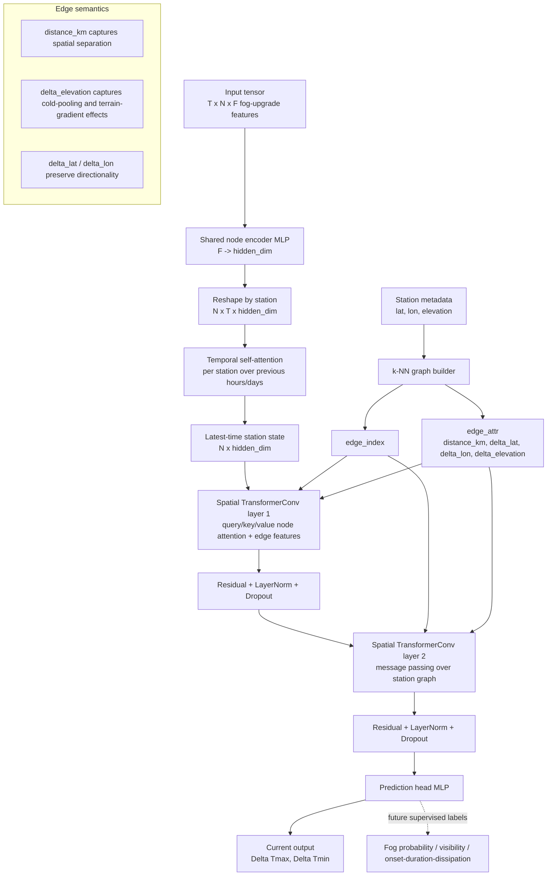

# Fog-Oriented MPT Diagrams

Date: 2026-04-26

## Research Pipeline Flow

```mermaid
flowchart LR
    A[ERA5 / ERA5-Land forcing<br/>Tmax, Tmin, T2m, Td2m, u10, v10, pressure] --> B[Station alignment<br/>KNMI / future Nepal station records]
    C[Static station features<br/>lat, lon, elevation, station graph] --> B
    B --> D[Hourly / daily feature engineering<br/>dewpoint spread, RH, wind speed, theta_v,<br/>theta_v tendency, seasonality]
    D --> E[Spatial graph construction<br/>k-NN edges with distance and delta elevation]
    D --> F[GNN precursor model<br/>station-level correction of near-surface meteorology]
    E --> F
    F --> G[Corrected local precursor fields<br/>temperature, humidity, wind, stability proxies]
    G --> H[Future fog target model]
    H --> I{Target depends on labels}
    I --> J[Fog occurrence / risk]
    I --> K[Visibility class or minimum visibility]
    I --> L[Onset, duration, dissipation timing]
    M[External coarse-grid baselines<br/>GraphCast / Aurora interpolated to stations] --> N[Station-level comparison]
    F --> N
    H --> N
```

## Spatiotemporal Message Passing Transformer Architecture

```mermaid
flowchart TB
    X[Input tensor<br/>T x N x F fog-upgrade features] --> NE[Shared node encoder MLP<br/>F -> hidden_dim]
    NE --> R[Reshape by station<br/>N x T x hidden_dim]
    R --> TA[Temporal self-attention<br/>per station over previous hours/days]
    TA --> LAST[Latest-time station state<br/>N x hidden_dim]

    S[Station metadata<br/>lat, lon, elevation] --> G[k-NN graph builder]
    G --> EI[edge_index]
    G --> EA[edge_attr<br/>distance_km, delta_lat, delta_lon, delta_elevation]

    LAST --> MP1[Spatial TransformerConv layer 1<br/>query/key/value node attention + edge features]
    EI --> MP1
    EA --> MP1
    MP1 --> LN1[Residual + LayerNorm + Dropout]

    LN1 --> MP2[Spatial TransformerConv layer 2<br/>message passing over station graph]
    EI --> MP2
    EA --> MP2
    MP2 --> LN2[Residual + LayerNorm + Dropout]

    LN2 --> HEAD[Prediction head MLP]
    HEAD --> Y[Current output<br/>Delta Tmax, Delta Tmin]
    HEAD -. future supervised labels .-> FOG[Fog probability / visibility / onset-duration-dissipation]

    subgraph Edge semantics
        E1[distance_km captures spatial separation]
        E2[delta_elevation captures cold-pooling and terrain-gradient effects]
        E3[delta_lat / delta_lon preserve directionality]
    end
```
